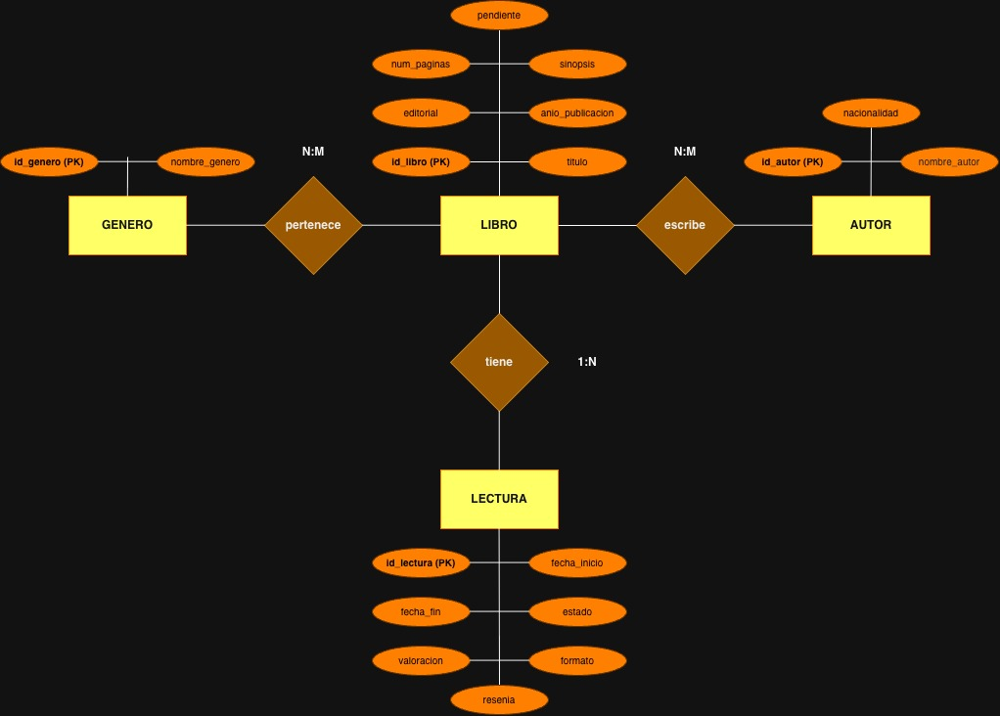
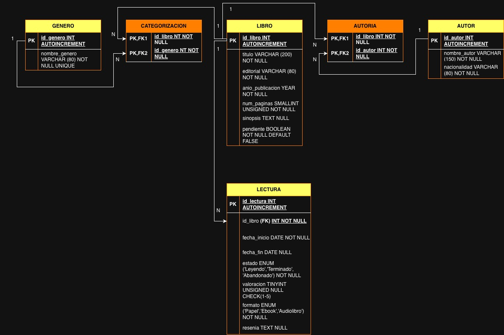

# SymbelLibrary
Es una base de datos personal para registrar y organizar mis lecturas, tanto las pasadas como las futuras.
Este proyecto surge con el objetivo de poner en práctica los conocimientos adquiridos sobre bases de datos relacionales 
y la curiosidad de trabajar con Docker para crear un entorno de desarrollo reproducible.

## Objetivos
- Registrar libros, autores e información sobre ambos.
- Clasificar libros por género.
- Registrar lecturas realizadas.
- Guardar información sobre cada lectura.
- Tener guardada una lista de libros pendientes de lectura.
- Practicar diseño y gestión de una base de datos relacional.
- Aprender a usar Docker.

## Tecnologías
- MariaDB
- phpMyAdmin
- Docker
- SQL

## Diseño de la BBDD
- Entidades: Libro, Autor, Género y Lectura
- Además, se utilizan dos tablas intermedias para resolver relaciones N:M : Autoría y Categorización.
- Diagramas Modelo Entidad-Relación y Modelo Relacional.
  
### Modelo Entidad-Relación

### Modelo Relacional

## Entorno Docker
Este proyecto utiliza Docker para ejecutar dos servicios:
- MariaDB como sistema de gestor de base de datos.
- phpMyAdmin como interfaz web para administrar MariaDB.
- Las credenciales se configuran mediante variables de entorno y no se almacenan en el repositorio.

## Estado del proyecto
Proyecto en desarrollo.

## Autoría
Belén Jiménez Sánchez
